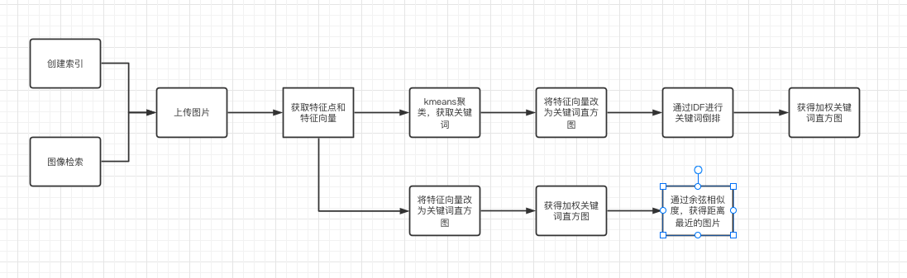

	图像检索

# 一、概述

## 背景和意义
在Web2.0时代，尤其是随着Flickr、Facebook等社交网站的流行，图像、视频、音频、文本等异构数据每天都在以惊人的速度增长。例如， Facebook注册用户超过10亿，每月上传超过10亿的图片；Flickr图片社交网站2015年用户上传图片数目达7.28亿，平均每天用户上传约200万的图片；中国最大的电子商务系统淘宝网的后端系统上保存着286亿多张图片。针对这些包含丰富视觉信息的海量图片，如何在这些浩瀚的图像库中方便、快速、准确地查询并检索到用户所需的或感兴趣的图像，成为多媒体信息检索领域研究的热点。基于内容的图像检索方法充分发挥了计算机长于处理重复任务的优势，将人们从需要耗费大量人力、物力和财力的人工标注中解放出来。

## 需求
经过十来来的发展，基于内容的图像检索技术已广泛应用于搜索引擎、电子商务、医学、纺织业、皮革业等生活的方方面面。

## 功能性要求
- 图像检索的功能：创建索引、使用索引
- 简洁的GUI界面：上传图片、检索图片

# 二、关键技术

## 采用硬件环境配置
- Macbook Air（13-inch，2019）+ 8G
- Windows x64 + 16G

## 开发环境
- PyCharm
- Goland

## 开发语言
- go 1.18
- Python3.9
- html、css、js

# 三、算法描述

## 流程图

# 四、系统实现

## 界面展示

	界面

## 功能展示

	功能0

	功能1

	功能2

	功能3

# 五、结语

在现如今的互联网时代，图像检索越来越常见，你可以在百度搜图、淘宝搜物，包括在推荐算法等等领域上都有它的一处之长。而我们利用一些深度学习算法可以解决一部分图像检索的问题，当然也有很多部分尚未被解决。

比如基于内容的图像检索：

还有很多很多需要算法工程师去探索。

----
## 鸣谢[胡大佬](https://github.com/Hukeqing)的指导。